# 실패 박물관 진행과정

> 이곳의 모든 전시품은 한때 의욕이 있었습니다.

망한 계획·다짐을 액자로 안치하는 3D 웹 박물관 「**실패 박물관**」을 만든 과정을 단계별 스크린샷과 함께 기록한 문서입니다. 코드를 push할 때마다 이 문서도 함께 갱신합니다.

- 공개 URL: <https://kimw0n.github.io/failure-museum/>
- 저장소: <https://github.com/kimw0n/failure-museum>
- 기술: 단일 `index.html` · Three.js 0.170 · supabase-js 2.117.2 · WebAudio · GitHub Pages
- 스크린샷: 각 버전의 커밋을 그대로 띄워 헤드리스 Chrome으로 촬영했습니다. v2·v3 화면은 실제 DB를 건드리지 않도록 **로컬 모드 + 예시 데이터**로 찍어서 상단에 노란 "로컬 모드" 배너가 보입니다. 예시 사진도 설명용 그림입니다.

## 한눈에 보기

| 버전 | 날짜 | 핵심 |
| -------------- | ---------------- | -------------------------------------------------------- |
| v1 (1~6단계) | 2026-09-29 | 로비·메인홀·신규 안치실·전당 4개 구역, 시드 15점, 사인별 진열 오브젝트, 등록·공감·승격, 관장 NPC, 사운드, GitHub Pages 배포 |
| v2 | 2026-09-29 | 시드 삭제(빈 박물관으로 시작), 모든 작품을 벽 액자로, 사진 첨부, Supabase 실시간 동기화 |
| v3 | 2026-09-30 | 박물관 구조 개편(순환 동선·7개 구역·미니맵), 빈 액자 슬롯에 직접 전시, 2주 자동 철거, 액자별 조명, Q/Esc 뒤로가기 |

## 1. v1 — 6단계로 만든 첫 박물관

요구 사항은 "장례식장처럼 엄숙한데 내용은 한심한 3D 박물관"이었습니다. 단계마다 브라우저에서 확인 가능한 상태로 커밋하며 진행했습니다.

### 1단계 · 씬 뼈대와 이동

첫 화면은 부고 카드 형식의 조작 안내입니다. 로비에서는 WASD와 마우스(PointerLock), 모바일에서는 왼쪽 가상 조이스틱과 오른쪽 드래그로 움직입니다. 포인터락이 막힌 환경(iframe 등)에서는 드래그로 둘러보도록 폴백을 넣었습니다.

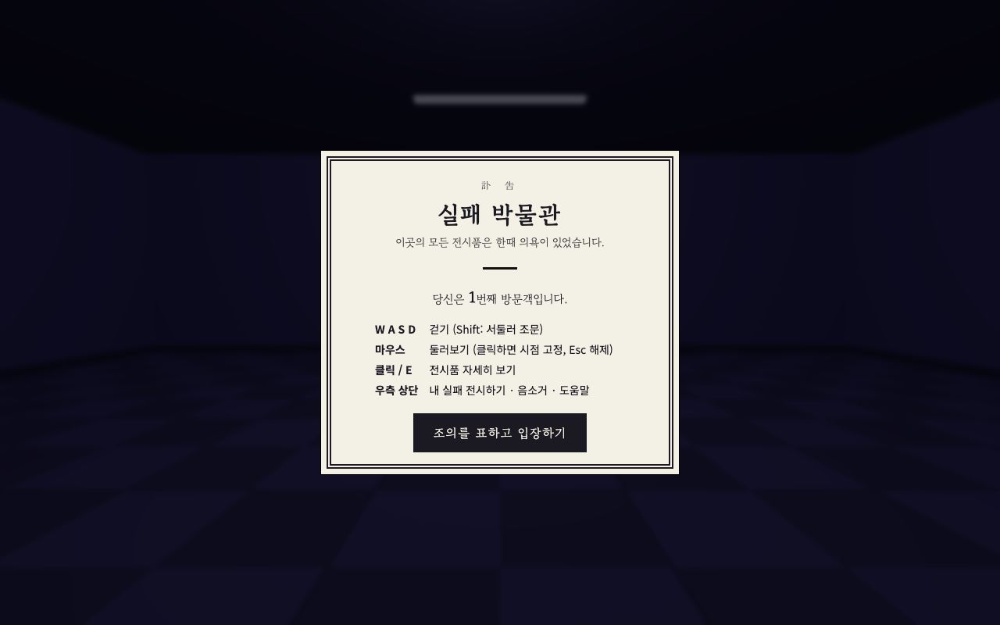

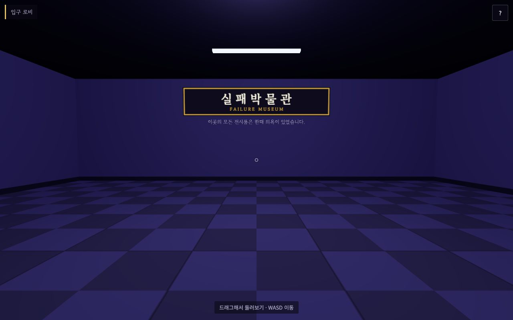

### 2단계 · 4개 구역과 진열장

한 건물 안에 로비, 메인홀(유리 진열장), 신규 안치실(관), 계단 위 전당(1~5위 포디움)을 배치했습니다. 벽·진열장 충돌, 계단 높이, 가끔 깜빡이는 형광등, 방향 표지판과 삐뚤어진 액자도 이때 넣었습니다.

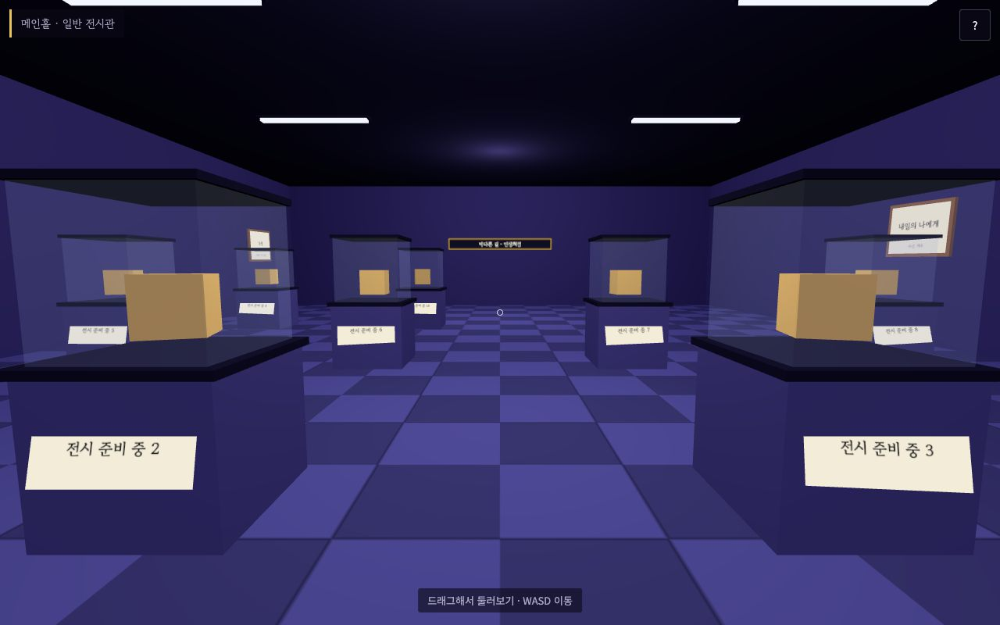

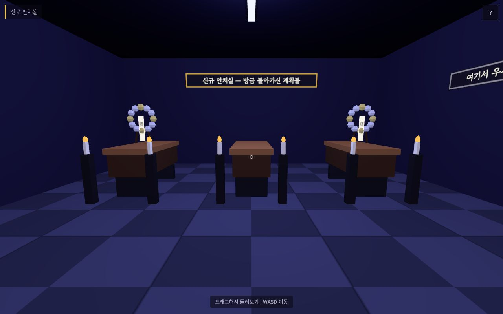

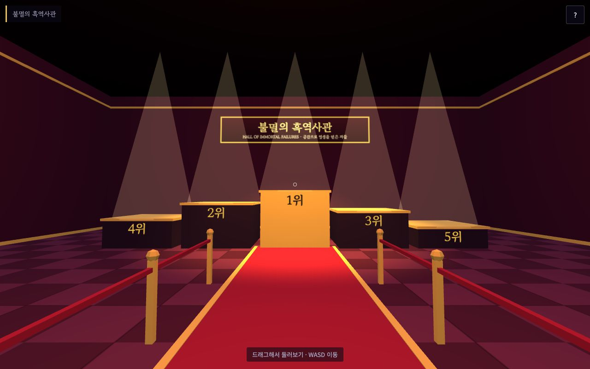

### 3단계 · 시드 데이터와 전당

웃긴 시드 15점을 직접 만들고, 사망 원인별로 진열 오브젝트를 다르게 만들었습니다(귀찮음=이불 덩어리, 마감=부서진 시계, 팀원 잠수=빈 의자 2개, 이미 있던 서비스=똑같은 상자 2개, 그냥 잠=Zzz 베개, 기타=물음표 상자). 공감 상위 5점은 전당 포디움 위에 **넘어진 금색 동상**(캡슐+구체, 바나나 껍질 포함)으로, 최신 3점은 안치실 관 위에 영정과 함께 놓였습니다.

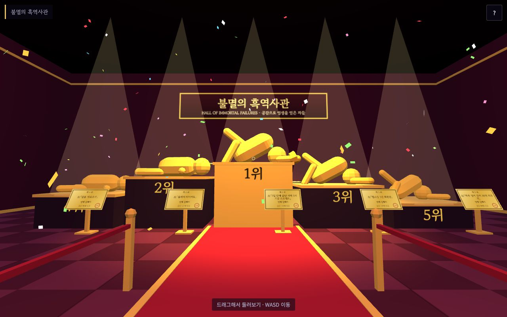

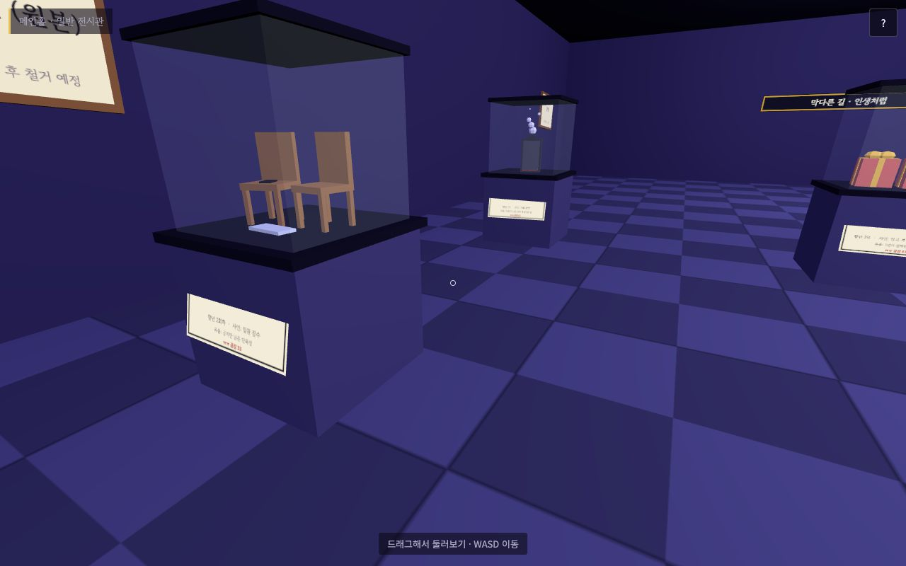

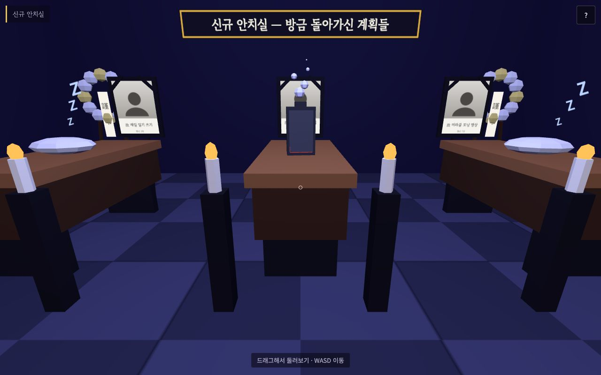

### 4단계 · 등록 · 공감 · 승격

"내 실패 전시하기" 모달(제목 40자·나머지 60자, 욕설·광고 금칙어, 30초 쿨다운), 조준 후 E/클릭으로 여는 상세 패널, "나도 이런 적 있음" 공감(브라우저당 1회), 순위가 오르면 "속보" 토스트, 명패 PNG 저장을 만들었습니다. 등록하면 카메라가 곡선 경로로 안치실까지 날아갑니다.

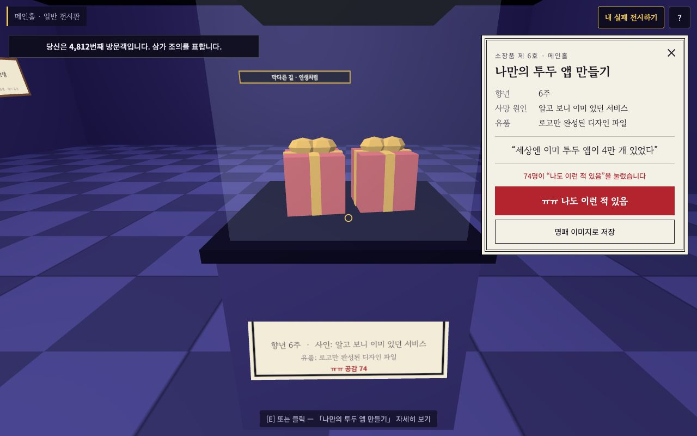

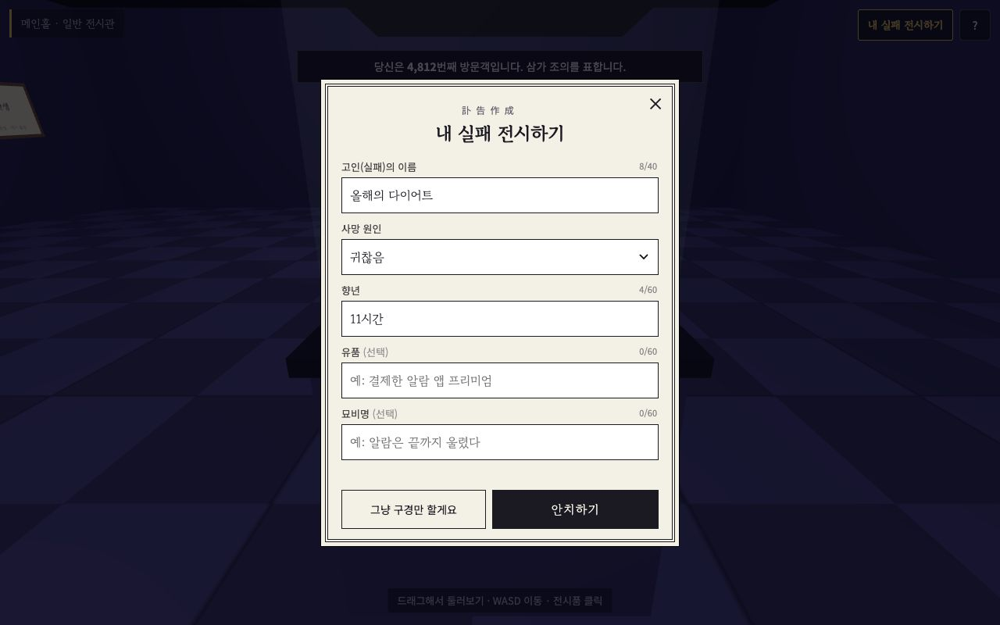

### 5단계 · 관장 NPC와 사운드

둥근 머리·정장·검은 넥타이의 관장이 구역마다 "먼저 와 있습니다". 입장·등록·전당·공감·가만히 있을 때·구경만 할 때 상황별 멘트 풀을 각 5개 이상 준비했고, 가까우면 말풍선, 멀면 하단 자막으로 보입니다. 사운드는 외부 파일 없이 WebAudio로 합성했습니다(슬픈 트롬본, 뿅, 팡파레, 형광등 웅/지직, 관장 웅얼웅얼).

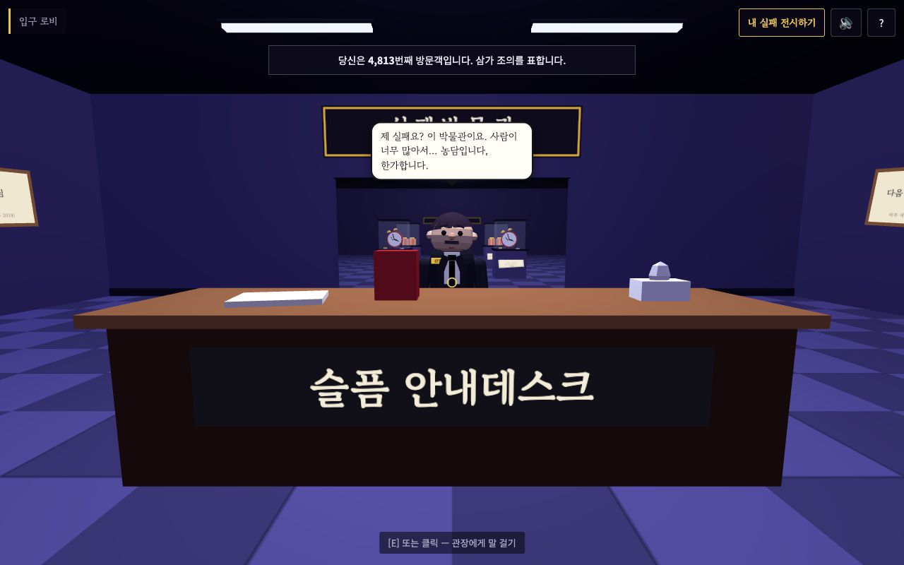

### 6단계 · 저장소와 배포

Supabase REST 저장소(실패 시 로컬 폴백)와 `schema.sql`(RLS·공감 RPC)을 만들고 모바일 HUD를 정리한 뒤 GitHub Pages에 배포했습니다.

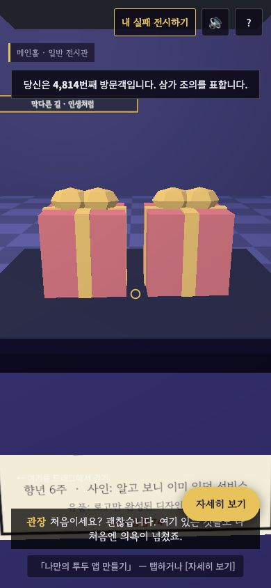

## 2. v2 — 액자 전시 · 사진 첨부 · 실시간 동기화

다른 사람이 등록한 작품이 내 화면에 안 보인다는 문제가 핵심이었습니다. 원인은 조용히 로컬 모드로 동작한 것이라, 연결 상태를 항상 드러내고 실시간 동기화를 기본으로 바꿨습니다.

- **시드·진열장·동상 삭제**: 박물관은 비어 있는 상태로 시작합니다("아직 아무도 실패하지 않았습니다. 첫 번째 고인이 되어주세요").
- **액자 전시**: 사진이 있으면 사진 액자, 없으면 사망 원인별 색 배경의 문구 액자 + 모서리 사인 뱃지. id로 고정된 ±3° 기울기. 일반관은 나무, 전당은 금색 대형 액자 + "명예 실패자" 리본.
- **사진 첨부**: 이미지 파일만 받고, 5MB가 넘으면 거절합니다. Canvas로 긴 변 1000px JPEG 0.8, 500KB가 넘으면 재압축하고, Storage `exhibit-photos`에 올립니다.
- **실시간**: Realtime 구독(INSERT/UPDATE) → 끊기면 5초 폴링 → 탭 복귀 시 즉시 동기화. 우측 상단 점(초록/노랑/빨강)과 로컬 모드 경고 배너로 상태를 보여줍니다.
- **낙관적 반영**: 브라우저가 만든 UUID로 서버 데이터와 합쳐서 중복 액자가 생기지 않습니다. 실패하면 되돌리고 폼을 다시 엽니다.

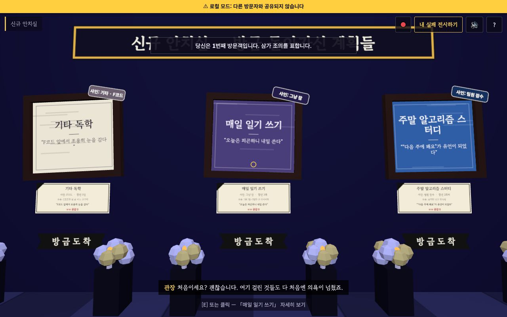

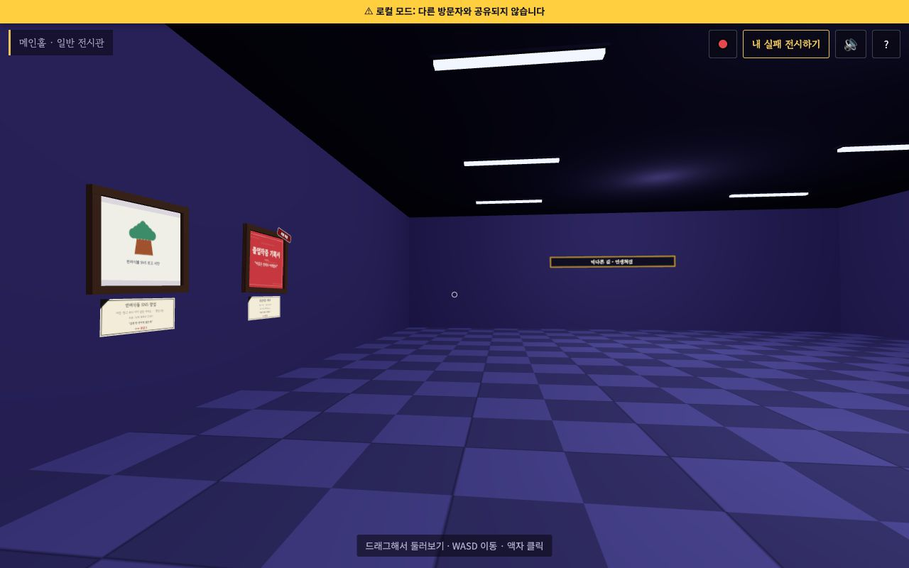

### v2 검증

Supabase와 같은 프로토콜의 로컬 목업(REST·Storage·Realtime 웹소켓)으로 먼저 검증한 뒤, 실제 Supabase 프로젝트로 다시 확인했습니다.

| 항목 | 결과 |
| ------------------------------------------ | ------------------------------------------ |
| A 창에서 사진 있는/없는 작품 등록 → B 창 | 새로고침 없이 0.3~0.65초 만에 액자 2개가 나타남, 중복 없음 |
| A 공감 → B 명패 숫자 | 약 0.35초 만에 반영, "속보" 토스트 |
| 5위 밖 작품에 공감 몰아주기 | 전당 진입 후 2위로 상승, 금액자 재배치 |
| 실시간 연결 끊김 (목업) | 노랑(폴링) → 복구 시 초록, 서버 다운 시 빨강 → 자동 복구 |
| 사진 20장 이상 · 30장 한꺼번에 도착 (목업, 모바일 화면폭) | 60fps 유지, 먼 액자 텍스처는 해제 |

실제 휴대폰에서의 fps와 카메라/앨범 선택 화면은 아직 직접 확인하지 못했습니다.

## 3. v3 — 박물관 구조 개편 · 빈 액자 슬롯 · 자동 철거

v3 작업(2026-09-30)은 다른 작업 세션에서 진행됐고, 이 문서에는 커밋과 README를 바탕으로 정리했습니다.

- **순환 동선**: 로비 → 중앙홀(깨진 "참가상" 트로피) → 후회의 회랑 → 울음방 → 로비, 중앙홀 → 귀찮음의 방 → 마감의 방, 미완성 갤러리. 계단 위 전당, 슬롯이 차면 늘어나는 별관. 우측 상단 미니맵(M).
- **빈 액자 슬롯**: 벽 곳곳의 빈 액자(90개)를 조준해 "여기에 전시하기"로 원하는 자리에 겁니다. 두 사람이 같은 자리에 걸면 DB가 한쪽을 거절하고 가장 가까운 빈 자리로 재배정합니다.
- **2주 자동 철거**: 일반 전시는 14일 뒤 철거(pg_cron), 전당은 영구 보존. 명패에 D-day, 철거 3일 전부터 "철거 예정" 스티커와 깜빡이는 액자등.
- **조명**: 모든 액자에 액자등 + 가짜 빛, 가까운 6개(모바일 4개)만 실제 SpotLight, ⚙ 밝기 설정.
- **조작**: Q/Esc로 열린 창을 한 단계씩 닫기, 모바일 ✕ 닫기 버튼.

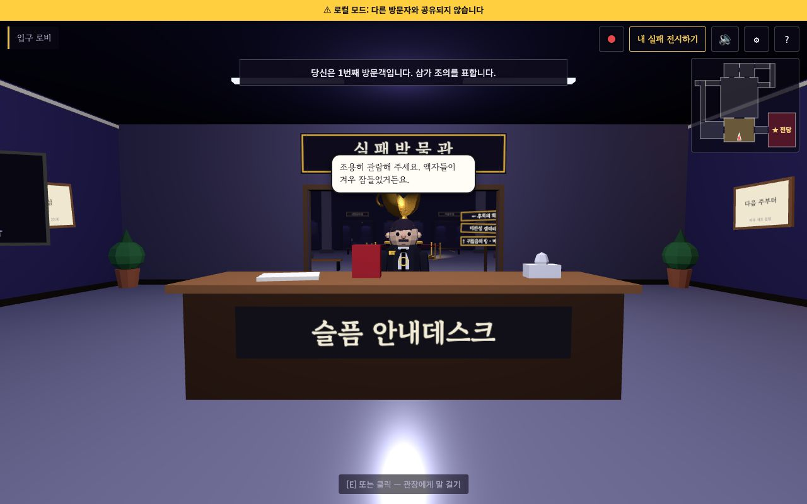

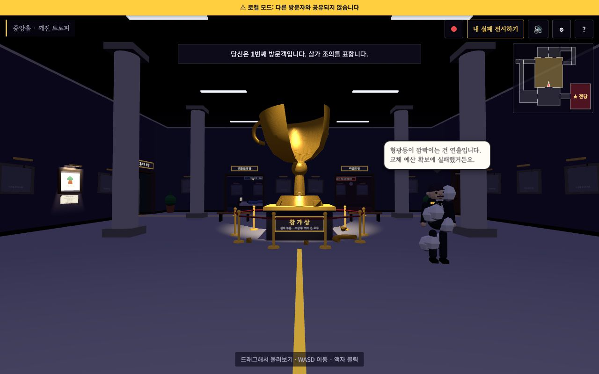

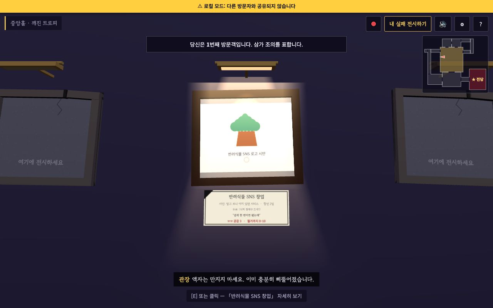

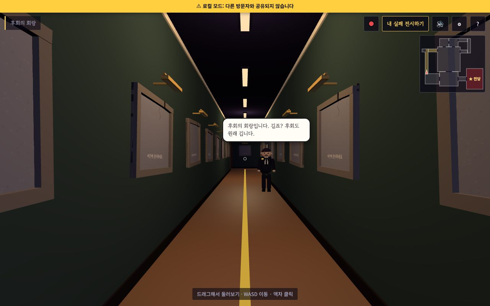

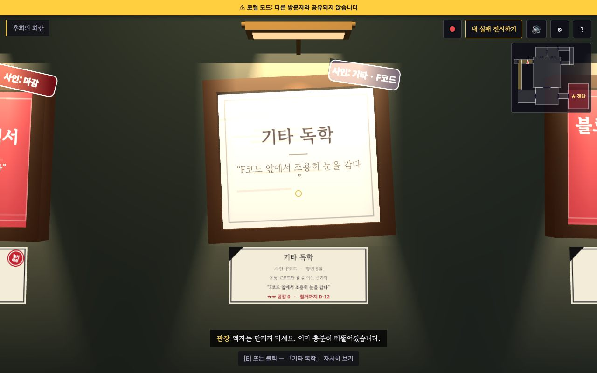

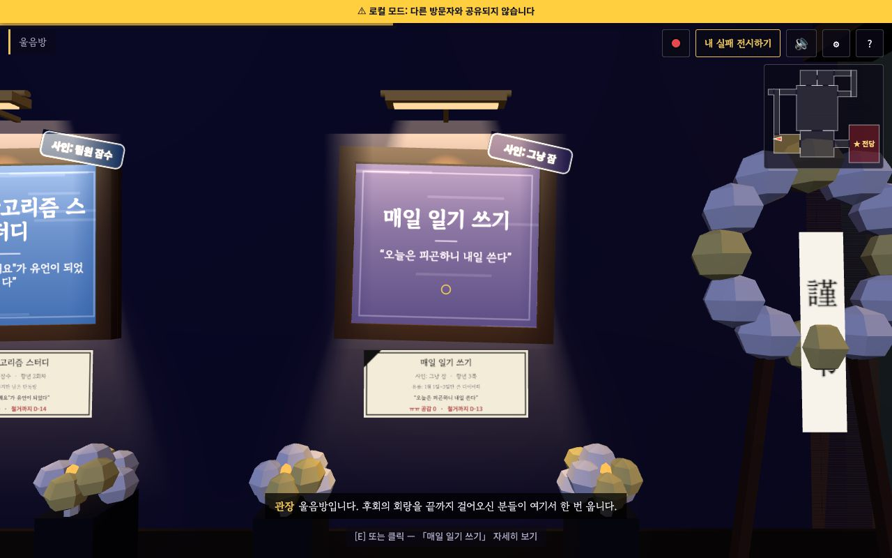

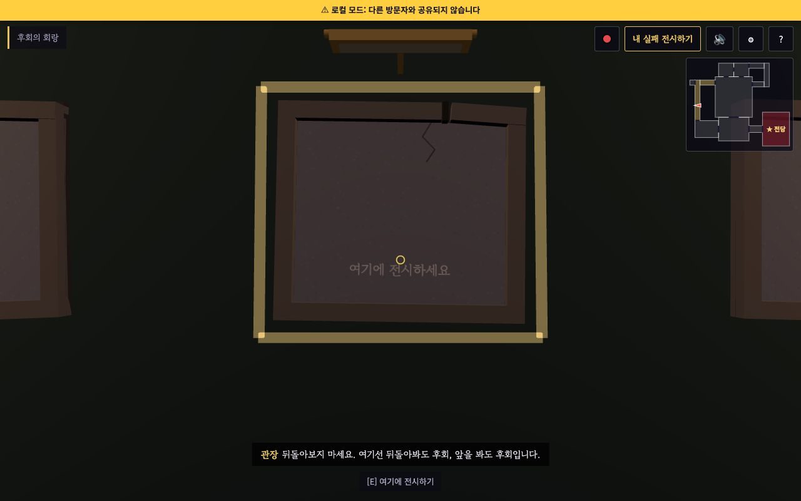

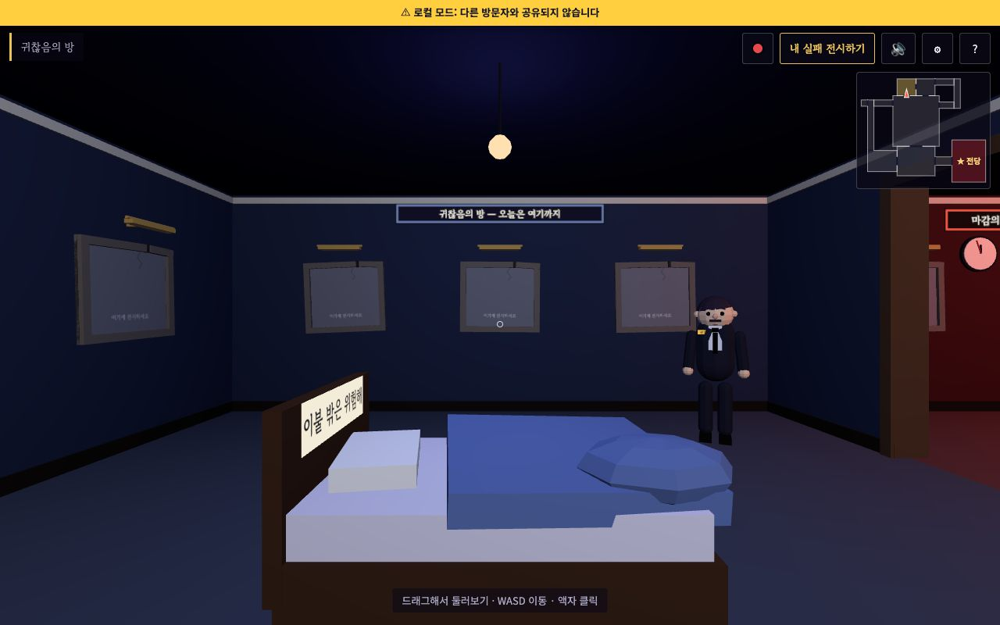

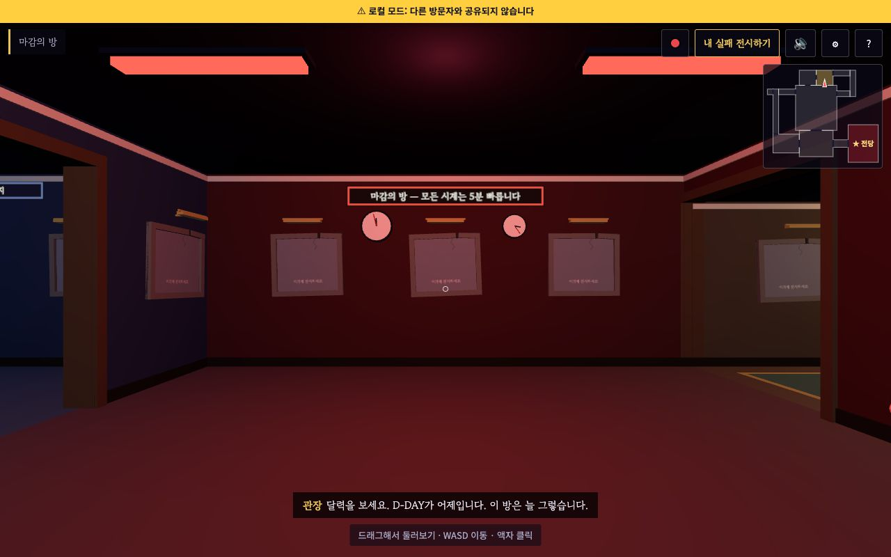

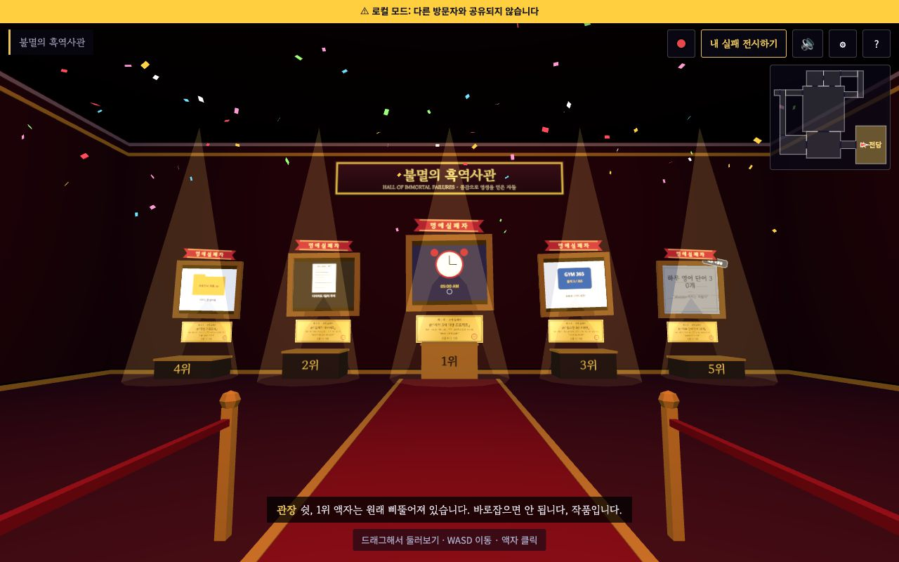

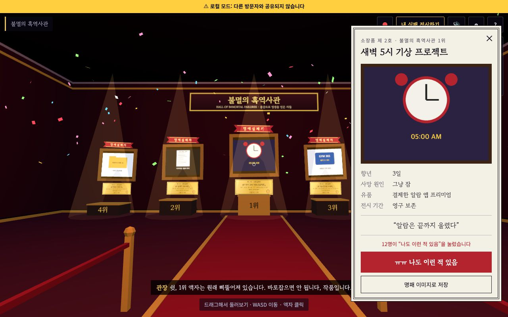

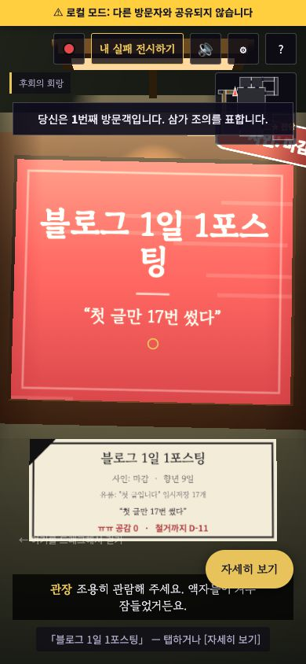

## 4. 운영 상태와 남은 일

- Supabase 프로젝트 연결 완료(`CONFIG`에 publishable 키). v3를 쓰려면 운영 DB에 `migration_v3.sql` 실행과 pg_cron 활성화가 필요합니다(README "v3 마이그레이션").
- 검증용 `[테스트]` 전시품은 대시보드에서 삭제해야 합니다(README "운영 메모").
- 아직 확인하지 못한 것: 실제 휴대폰 성능, 모바일 카메라/앨범 선택, 소리.

## 부록 · 커밋 기록

push할 때 `docs/build_progress.py`가 git 기록으로 자동 생성합니다.

<!-- COMMITS:START -->
| 날짜 | 커밋 | 내용 |
| -------------------- | --------- | ------------------------------------------------------------- |
| 2026-09-30 10:28 | `963da3d` | 관장 멘트: 새 구조(중앙홀·울음방·빈 액자)에 맞게 수정 |
| 2026-09-30 10:27 | `920c936` | README: Q/E/M 조작, 박물관 구조, 빈 액자 전시, 2주 자동 철거 정책, v3 마이그레이션·pg_cron·사진 수동 정리 절차 |
| 2026-09-30 10:22 | `df3f321` | 액자별 조명: 액자등 메시, 가짜 빛(가산 평면·원뿔 광), 가까운 6개만 실제 SpotLight, 밝기 설정 |
| 2026-09-30 10:15 | `7e39ca8` | 2주 뒤 자동 철거(전당 제외): expires_at · in_hall, DB 전당 재계산, pg_cron, 사진 정리 트리거 |
| 2026-09-30 10:08 | `3f86cf1` | 빈 액자 전시 시스템: 조준해서 원하는 자리에 전시, 슬롯 충돌 처리, 실시간 반영 |
| 2026-09-30 10:00 | `616622f` | 박물관 구조 개편: 중앙홀·후회의 회랑·미완성 갤러리·귀찮음/마감의 방, 미니맵, 충돌, 컬링 |
| 2026-09-30 09:53 | `268173c` | Q/Esc 뒤로가기: 열린 UI를 한 단계씩 닫기 (위치·시야 이동 없음) |
| 2026-09-29 14:00 | `f6d10fc` | Supabase 연결: CONFIG 설정, URL에 /rest/v1 등이 붙어 있어도 프로젝트 주소로 정규화 |
| 2026-09-29 13:40 | `62a667e` | README: Supabase 설정 순서(초보자용), 데이터 흐름, 체크리스트 갱신 |
| 2026-09-29 13:40 | `2ff6462` | schema.sql: photo_url, UUID id, Storage 버킷·정책, Realtime publication, 시드 제거 |
| 2026-09-29 13:40 | `36a098b` | 시드·진열장·동상 제거, 액자 전시·사진 첨부·실시간 동기화로 전환 |
| 2026-09-29 10:31 | `f1ffbb7` | 6단계: Supabase REST 저장소(로컬 폴백), schema.sql(RLS·RPC·시드), README, 모바일 HUD 정리 |
| 2026-09-29 10:27 | `d172c73` | 5단계: 관장 NPC(상황별 멘트 풀, 말풍선/자막), WebAudio 트롬본·뿅·팡파레·형광등, 음소거 |
| 2026-09-29 10:23 | `ca9ec55` | 4단계: 실패 등록 모달(금칙어·글자수 제한), 공감(1인 1회), 전당 승격 속보, 명패 PNG 저장 |
| 2026-09-29 10:17 | `327b7e2` | 3단계: 시드 전시품 15개, 사망 원인별 오브젝트, 명패/영정, 전당 금색 동상과 색종이 |
| 2026-09-29 10:12 | `b8177d4` | 2단계: 4개 구역(로비/메인홀/신규 안치실/전당)과 진열장, 표지판, 형광등 깜빡임 |
| 2026-09-29 10:06 | `4317610` | 1단계: 씬 뼈대, 로비, WASD/포인터락/모바일 조이스틱 이동 |
<!-- COMMITS:END -->

## 이 문서를 갱신하는 방법

1. 코드를 바꾸면 이 파일(`docs/PROGRESS.md`)에 변경 내용과 새 스크린샷(`docs/img/`)을 추가합니다.
2. `python3 docs/build_progress.py`를 실행하면 커밋 기록이 갱신되고 Word 파일 `docs/진행과정.docx`가 다시 만들어집니다(pandoc 필요).
3. 문서도 함께 커밋해서 push합니다. 문서가 코드보다 오래됐으면 `pre-push` 훅이 push를 막고 안내합니다(급할 때는 `git push --no-verify`).
